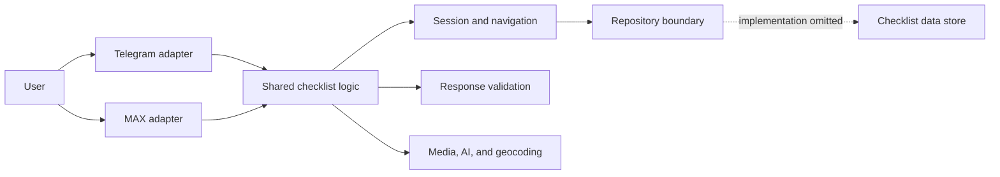

# Multichannel Checklist Bot

An asynchronous, data-driven checklist engine shared by Telegram and MAX bots.

> This repository is a sanitized portfolio snapshot of a production system. Runtime configuration, credentials, the database adapter implementation, SQL schemas and routines, and production data are intentionally excluded. The code is intended for architecture and implementation review rather than turnkey deployment.

## Overview

The project delivers one checklist-processing system through two messaging platforms:

- the Telegram bot receives updates through long polling;
- the MAX bot receives events through a FastAPI webhook;
- a shared, platform-independent layer manages user state, validates responses, and controls transitions between checklist steps;
- checklist definitions and localized text are loaded through a repository abstraction, while execution results are persisted through the same boundary;
- integration services handle media storage, geocoding, and automated image validation.

The core design goal is to keep checklist rules independent of any specific messenger. Both channels reuse the same validation, state-management, and navigation logic. Their adapters handle platform events and presentation while delegating reusable workflow operations to the shared layer.

## What This Repository Demonstrates

- asynchronous Python application design across multiple messaging channels;
- separation between platform adapters, shared business logic, and external integrations;
- data-driven checklists whose structure and behavior are defined outside the bot code;
- conditional navigation between steps and recovery of unfinished user sessions;
- shared processing of text, buttons, dates, locations, and media across platforms;
- background delivery of queued outbound messages;
- localized interface text and reusable keyboard-generation components;
- validation of external media URLs and centralized handling and logging of network failures.

## Checklist Lifecycle

1. The Telegram or MAX adapter resolves the sender's shared session context.
2. The system retrieves the current checklist step and its options through the repository layer.
3. The adapter dispatches the event for the active step type and delegates reusable validation and persistence operations to shared handlers.
4. The platform-specific renderer creates buttons, a calendar, a location request, or a media-upload prompt.
5. Shared logic validates the response and requests persistence through the data-access abstraction.
6. Based on the result, the system advances, follows a conditional branch, or completes the checklist.



## Supported Step Types

| Type | Behavior |
| --- | --- |
| `text` | Text input with length and regular-expression validation |
| `amount` | Numeric input constrained by a configured range |
| `toggle` | Yes/no input validated against an expected value |
| `rating` | Rating selection through inline buttons |
| `spinner` | A numeric counter with minimum, maximum, and default values |
| `multi-spinner` | Multiple independent counters within one step |
| `select` | Multiple selection with option limits and search |
| `choice` | Single selection with searchable options |
| `date` | Calendar input with an optional allowed date range |
| `map` | Address search, result selection, and location confirmation |
| `geo-position` | Coordinates received directly from the messenger |
| `photo` | Multiple uploads, uniqueness checks, and optional AI validation |
| `video` | Video upload and storage |
| `document` | Document upload and storage |

## Project Structure

```text
.
├── apps/
│   ├── telegram/          # Telegram polling, handlers, and keyboards
│   └── max/               # MAX webhook, API client, and handlers
├── common/
│   ├── callbacks.py       # Platform-independent actions and transitions
│   ├── keyboards.py       # Shared keyboard-building rules
│   ├── media.py           # Shared photo, video, document, and location logic
│   ├── session.py         # User state and checklist lifecycle
│   └── validators.py      # User-input validation
├── services/
│   ├── ai_service.py      # Image-analysis service integration
│   ├── geo_service.py     # Geocoding and address search
│   ├── http_client.py     # Shared asynchronous HTTP client
│   └── storage_service.py # Media download, conversion, and upload
├── utils/                 # Localization, logging, and helper functions
├── main.py                # Platform launch commands
├── Dockerfile
└── docker-compose.yml     # Illustrative service configuration
```

## Architecture

### Platform Adapters

Each messenger has its own event handlers and keyboard renderer. Telegram uses `python-telegram-bot`, while the MAX adapter includes an asynchronous HTTP API client. Both adapters translate platform-specific events into calls to the shared layer and render the result using the capabilities of the target platform.

### Shared Business Logic

`Session` tracks the active checklist and step, selected options, counter values, uploaded files, and intermediate results. In-memory sessions are keyed by both platform and user ID, preventing collisions when different channels use the same numeric identifier.

`Session` and `ChecklistLogic` jointly manage navigation, persistence requests, conditional branching, and checklist completion. Their shared workflow code contains no Telegram- or MAX-specific dependencies and is reused by both bots.

### Integration Services

- a shared `httpx` client reuses connections, logs network errors without exposing full URLs, and centralizes resource cleanup;
- the storage service downloads files, converts images when required, and uploads media to an external store;
- the geocoding service supports both address search and reverse geocoding;
- the AI service can verify whether an image matches a checklist step and extract a numeric value from an image;
- background jobs retrieve queued messages and deliver them through the appropriate channel.

## Technology Stack

- Python 3.12 and `asyncio`;
- `python-telegram-bot` for Telegram integration;
- FastAPI and Uvicorn for the MAX webhook application;
- `httpx` for asynchronous HTTP requests;
- APScheduler through the Telegram job queue and a dedicated `asyncio` task for background message delivery;
- Pillow for image processing;
- RapidFuzz for searching large option lists;
- PostgreSQL and SQLite in the omitted private data-access layer;
- Docker and Docker Compose as an example of separate channel deployment.

## Intentionally Omitted Components

The public snapshot does not include:

- configuration files or settings modules;
- bot tokens, API keys, webhook secrets, or other credentials;
- the `database` package implementation;
- production SQL queries, schemas, stored routines, or migrations;
- production data, logs, local databases, or access keys;
- internal infrastructure used by the storage and AI services.

The remaining `repo.*` calls show only the boundary between the application and its data-access layer. They contain neither SQL implementation details nor production infrastructure parameters.

## Public Snapshot Status

This repository does not run as-is because its configuration and data-access implementations are intentionally absent. The Docker files are included to illustrate how the two channels are separated, not as a production-ready deployment configuration.

The published code is primarily intended to demonstrate:

- reuse of business logic across messaging platforms;
- extensibility through additional checklist step types;
- isolation of platform-specific behavior;
- asynchronous external-service integration;
- error handling and state preservation between messages.

## Publication Safety

`.gitignore` and `.dockerignore` exclude local configuration, environment files, databases, logs, IDE metadata, and access keys. If this snapshot is added to an existing Git repository, its full history should still be scanned for secrets: deleting a sensitive file from the current working tree does not remove it from earlier commits.

## Limitations

- Automated tests are not included in this sanitized public snapshot.
- Checklist definitions and storage contracts are visible only through their use by the application layer.
- Running the system requires replacement implementations for configuration, persistence, and private external services.

## Repository Purpose

This repository is published as an example of designing and implementing a multichannel asynchronous bot. The original production system depends on private infrastructure; this snapshot preserves the application architecture and core implementation while keeping internal data and SQL components confidential.
